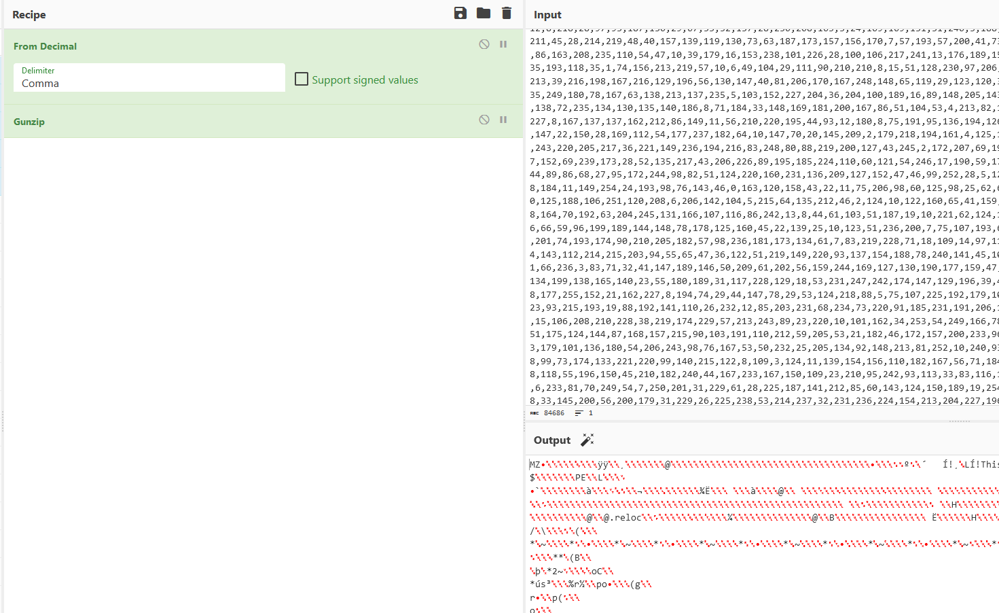

# Introduction

Last month, I discovered a report on a threat group known as TA2541. In this report by [Proofpoint](https://www.proofpoint.com/us/blog/threat-insight/charting-ta2541s-flight), researchers have detailed the capabilities of this threat actor, highlighting its tactics and potential motivations.

In this article, I review the main findings of the report and discuss how to mimic this TA by replaying its infection chain. In addition, I will analyze the infection from a DFIR perspective and examine possible response strategies.

# Emulation Part

For the purpose of this article, I have emulated the following infection chain:

*Figure 1 - TA2541 Infection chain*

## Initial Compromise with email

In this infection chain, the initial stage typically involves a phishing email that contains a PDF document as an attachment. The PDF file is crafted to deceive the victim into clicking on a Google Drive link, which ultimately results in the download of a malicious VBS.

Once executed, the VBS initiates a sequence of malicious actions, allowing the threat actor to establish a foothold in the victim's environment.

In this infection, the threat actor utilizes the "double extension" technique to trick users who might overlook file extensions. For instance, they could name a file as follows: **``charters details.pdf.vbs``**.

For demonstration purposes, I created a phishing e-mail containing a PDF file as an attachment and sent it to my mailbox. The PDF file contained a link to a Google Drive folder in which I temporarily hosted the malicious VBS.

## Stage 1 - VBS

To emulate this stage, I replicated the script mentioned in the Proofpoint report, and then substituted the TA's Paste.ee link with the one I provided. The link I used had the content of stage 2 of the attack.

The analysis of this script will be revisited in a subsequent section of the article as part of my DFIR investigation.

## Stage 2 - PowerShell & AsyncRAT

The second stage is a PowerShell script, this script allows to compile an embedded AsyncRAT payload in a byte array and inject them with a [RunPE](https://github.com/NYAN-x-CAT/CSharp-RunPE) technique in the memory land of a process. You can find it on this [AnyRun]( https://app.any.run/tasks/5f25a741-686d-4db3-920d-07b97b6e20c3/) task.

It also drops a VBS to establish a persistence in the startup folder.

To emulate this part, I went to AsyncRAT's github repo: [https://github.com/NYAN-x-CAT/AsyncRAT-C-Sharp](https://github.com/NYAN-x-CAT/AsyncRAT-C-Sharp) and generated a payload that I encoded to integrate into the script in place of the TA payload. We'll talk about the encoding and analysis of this script in the following section.

With the complete infection chain, I launched it by simulating the behavior of a user who receives the phishing e-mail and clicks on the first VBScript file on a GDrive link.

# Respond Part

Now, let's assume the role of an Incident Responder who has been called in to investigate a computer incident detected by a Security Operations Center (SOC) due to a possible connection to IP address 192.168.1.38, possibly a C2 AsyncRAT, reported by a network intrusion detection system (NIDS). The user of the affected system informs you that he has not noticed any suspicious behavior.

I've deployed a Velociraptor agent in server/client mode (like an EDR), which allows me to see what's currently happening on the system and perform live forensic analysis.

To begin my investigation, I did a hunt to retrieve the list of processes running on the machine, network connections, user activity (Proof of Execution, Browser History and Download History), and I also looked for persistence traces on the system.

## Process list

I used Velociraptor's **``Generic.System.Pstree``** artifact to list all running processes on the current system. This is a quick win, as you can immediately see a suspicious call sequence, a suspicious process name or a process launched from a suspicious path.

*Figure 2 - Process list*

As this is a case of process injection, there's nothing wrong with the system if you rely on the process list alone. That's why I switched to network connection analysis.

## Network Connexion

To analyze network connections, I used the **``Windows.Network.NetstatEnriched``** artifact, which gives me a netstat command on the system but enriched with process name and path, authenticode information or network connection details. 

*Figure 3 - Network Activity*

I noticed that a process called **``RegSvcs.exe``** located in **``"C:\Windows\Microsoft.NET\Framework\v4.0.30319\RegSvcs.exe"``** was establishing a network connection with the possible AsyncRAT C2. After researching the purpose of **``Regsvcs.exe``**, it turned out to be a tool called NET Services Installation to perform the following actions: 

- Load and register an assembly;
- Generate, register and install a type library in the specified COM+ application;
- Configure the services you have programmatically added to your class.

To be honest, I didn't know whether this behavior could be caused by a legitimate action. To find out whether it was a process infected by code injection, I analyzed it with the Hollow Hunts tool and, if the result was positive, scanned it with a YARA rule detecting an AsyncRAT payload.

## Process scan

### Hollows Hunter

Hollows Hunter is a tool from [hasherezade](https://github.com/hasherezade/hollows_hunter). It analyzes all running processes, recognizing a variety of potentially malicious implants (replaced/implanted PEs, shellcodes, hooks, memory patches).

Running it via the **``Windows.Memory.HollowsHunter``** artifact on the **``RegSvcs.exe``** process, which looks legitimate at first glance, you can see that the tool reports that a PE has been implanted in this process via code injection. 

This confirms the suspicion, so all that remains is to identify it with YARA and dump the injected PE for analysis.

*Figure 4 - Hollows Hunter output*

### YARA 

Using the Windows.Detection.Yara.Process artifact, I pointed a YARA rule created by [IrishIRL](https://github.com/IrishIRL/yara-rules/blob/main/RAT_AsyncRAT.yara) to detect AsyncRAT, and it turns out that this rule matched with the **``RegSvcs.exe``** process.

*Figure 5 - AsyncRAT Yara rule match RegSvcs.exe*

I've now been able to tell that this was a true positive, but now we need to find out how this process got infected by finding the root cause. 

I then relied on the user activities I collected earlier with my hunt query.

## User Activity

### Evidence of download

The **``Windows.Analysis.EvidenceOfDownload``** artifact allows you to search the directory provided for any file whose Alternative Data Stream (ADS) is named ``Zone.Identifier``, then lists it. It lists all files with a ``ZoneId`` equal to 3 or 4, calculates the file's hash value and prints the contents of the ``Zone.Identifier`` stream, as it may contain useful information in certain cases.

*Figure 6 - Evidence of Download*

We can see that a VBS with a double extension has been downloaded from Google Drive into the user's download directory. Thanks to the [Virtual Filesystem](https://docs.velociraptor.app/docs/gui/vfs/) provided by Velociraptor, which allows me to download any file on the system, I was able to proceed with its analysis:

*Figure 7 - Content of the VBS*

This script is obfuscated, and includes a variable named **``JAVA``** which contains a reversed PowerShell command. This command will be reversed to its original form using the **``StrReverse``** function and saved in the **``Everything``** variable.

Here is the PowerShell command once it is reversed:

*Figure 8 - Reversed command*

By reading and decoding it, the script use **``Invoke-WebRequest``** cmdlet to download the contents of a PowerShell script on Paste.ee, places it and then executes it in **``"C:\Users\Public"``** under the name **``RemoteFramework64.PS1``**. 

Going back to the Velociraptor's Virtual Filesystem, it turns out that **``RemoteFramework64.PS1``** is still present on the system. So I downloaded it and analyzed it:

*Figure 9 - Content of the stage 2 PowerShell script*

You can see that it's a PowerShell script used to compile a payload and then inject it using a RunPE technique into **``RegSvcs.exe``** , so it's this script that's causing the alert issued by the SOC. 

The AsyncRAT payload, the VBS used to perform persistence and the code responsible for injecting the process are stored in byte arrays. 

To be able to read them, I had to read the Decompress function, which decompresses them to make them usable. It turns out that they are compressed with gzip and then transformed into comma-separated decimals. In this case, the CyberChef solution helped me to read them in clear.

*Figure 10 - Cyberchef Recipe*

All that remains is to analyze the user's web history to find out when he downloaded the script from Google Drive, and why not make sure there are no other persistent files on the system.

### Web History

Using the artifact **``Windows.Applications.Chrome.History``** I was able to obtain a view of the user's web history. Using this history, you can see that the user went to his Gmail inbox, consulted an e-mail named **``URGENT RFQ // Aircraft Parts - REF 678876``** and then pivoted to Google Drive with the page title **``charters details.pdf.vbs - Google Drive``** and the link to download the file. This is the page for download the stage 1 script, and it tells us that the root cause is a phishing e-mail. 

We'll ask the user for further explanation, so that we can view the e-mail and retrieve its headers.

*Figures 11 & 12 - User web history*

## Persistence

To analyze persistence mechanisms, I used the **``Windows.Packs.Persistence``** artifact pack, as well as the **``Windows.System.TaskScheduler``**, **``Windows.Persistence.Wow64cpu``** & **``Windows.Persistence.PowershellProfile``** artifacts.

After examining the various results, we can see that the VBS named **``SystemFramework64Bits.vbs``** placed by the powershell script I analyzed above is present in the startup folder **``"C:\Users\y0sh\AppData\Roaming\Microsoft\Windows\Start Menu\Programs\Startup"``**. 

*Figure 13 - Content of the Startup Folder*

By downloading this script with the Velociraptor's Virtual Filesystem, you can notice that it will launch the PowerShell script (Stage 2) described above after each start-up of the compromised session of the system:

*Figure 14 - Content of SystemFramework64Bits.vbs*

## Timeline

To complete the investigation, it would be prudent to examine both the Master File Table and the USN Journal Analysis log. In this way, an exhaustive chronology can be established of the date and type of malicious files created on the system:

- **Master File Table (MFT) Analysis:** The MFT is a crucial component of the NTFS file system, and it contains metadata about each file and directory on the disk. By analyzing the MFT, we can identify file creation timestamps, modification timestamps, and access timestamps. This will enable us to pinpoint the exact times when the malicious files were created, modified, or accessed on the system.

- **USN Journal Analysis:** The USN journal is a feature in Windows operating systems that records changes made to files and directories on an NTFS volume. It maintains a log of these changes, providing valuable information about file creation, modification, and deletion events. By examining the USN journal, we can obtain a comprehensive view of all file-related activities, including those associated with the malicious files involved in the incident.

By combining data from MFT and USN log analysis, you can create a detailed timeline of the attack's progression, which will help us understand how the malicious files were introduced and propagated through the system. 

I could also talk about the different Event ID's within EVTX, but to keep the article short for the reader, I've decided not to write about this part. 

This chronology will be an essential asset in the incident response process, and will help to formulate an effective plan to mitigate the threat and prevent its recurrence in the future.

| Type of Action  | Description | Timestamp (UTC+0) |
| --- | --- | --- |
| [WEB HISTORY] Google Mail - Mailbox | Title: Boîte de réception (1) - REDACTED@gmail.com - Gmail | 2023-07-23T17:05:37Z |
| [WEB HISTORY] Google Mail - Suspicious Mail | Title: URGENT RFQ // Aircraft Parts - REF 678876 - REDACTED@gmail.com - Gmail | 2023-07-23T17:05:56Z | 
| [WEB HISTORY] Google Drive - Malicious download webpage | Title: charters details.pdf.vbs - Google Drive| 2023-07-23T17:06:59Z |
| [USER ACTIVITY - DOWNLOAD] Download of charter details.vbs | Path : C:\Users\y0sh\Downloads\charters details.pdf.vbs ZoneId = 3 ReferrerUrl = https://drive.google.com | 2023-07-23T17:08:12Z |
| [USN] Presence of RemoteFramework64.PS1 | FullPath : C:\Users\Public\RemoteFramework64.PS1 Reason : FILE_CREATE | 2023-07-23T17:08:32Z |
| [PERSISTENCE - STARTUP FOLDER / USN] SystemFramework64Bits.vbs | OSPath : C:\Users\y0sh\AppData\Roaming\Microsoft\Windows\Start Menu\Programs\Startup\SystemFramework64Bits.vbs Reason : FILE_CREATE | 2023-07-23T17:08:34Z |

I recommend the collaborative incident response platform [DFIR-IRIS](https://dfir-iris.org/) to do this more professionally.

# Conclusion

Thanks to Velociraptor's innovation and the analysis of forensic artifacts, I was able to unravel the chain of compromise orchestrated by TA2541. 

Velociraptor's capabilities proved to be essential in dissecting the threat actor's tactics, enabling us to trace his steps through the various stages of the attack lifecycle. From the initial obfuscated VBS file hosted on Google Drive URLs to the execution of PowerShell and the subsequent deployment of AsyncRAT in memory, we meticulously reconstructed the adversary's modus operandi.

# References 

[https://www.proofpoint.com/us/blog/threat-insight/charting-ta2541s-flight](https://www.proofpoint.com/us/blog/threat-insight/charting-ta2541s-flight)

[https://blog.bushidotoken.net/2021/01/analysis-of-netwire-rat-campaign.html](https://blog.bushidotoken.net/2021/01/analysis-of-netwire-rat-campaign.html)

[https://twitter.com/MsftSecIntel/status/1392219299696152578](https://twitter.com/MsftSecIntel/status/1392219299696152578)

[https://blog.morphisec.com/revealing-the-snip3-crypter-a-highly-evasive-rat-loader](https://blog.morphisec.com/revealing-the-snip3-crypter-a-highly-evasive-rat-loader)

[https://blog.talosintelligence.com/operation-layover-how-we-tracked-attack/](https://blog.talosintelligence.com/operation-layover-how-we-tracked-attack/)
