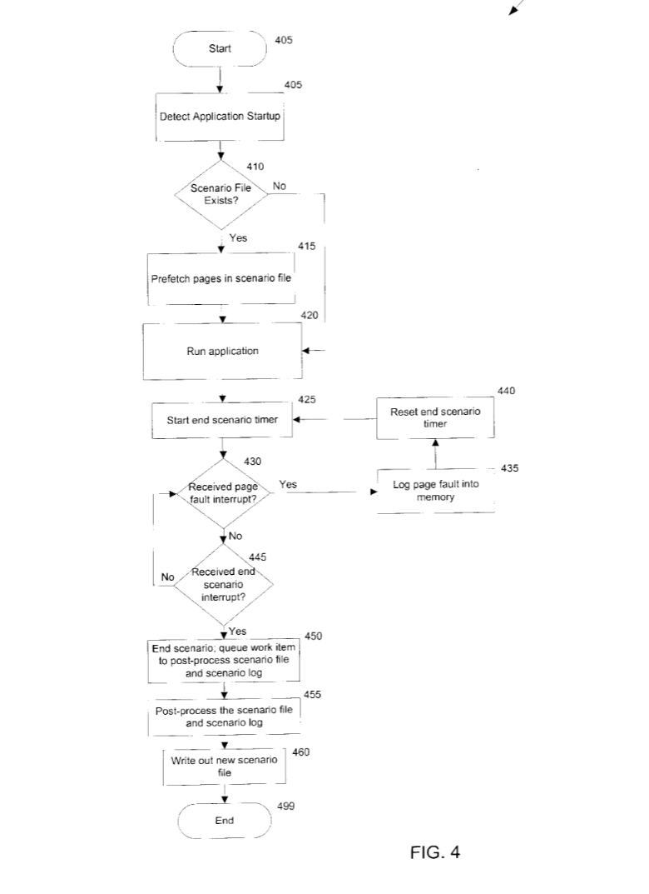

In the world of DFIR, the **Prefetch file (.pf)** is a long-time companion. It’s one of the first digital forensics artifacts we analyze on a Windows workstation to confirm program execution, obtain a timestamp, determine run counts and so on... During many trainings, we’re taught a simple rule of thumb:

:::note
*"An application needs to run for about 10 seconds to generate a valid Prefetch file."*
:::

I applied this rule without ever questioning it. I knew it worked, but I didn’t truly understand the reasoning behind it. **Why 10 seconds? Why not instantly? What is the operating system actually doing during that delay? And where did this technology originally come from?**

This article documents this small research project.

# The Genesis: Solving the "Seek" Penalty

The Prefetch mechanism is a fundamental innovation within Microsoft Windows operating systems, first officially introduced with **Windows XP**. Its technical origin is rooted in the patent [US 6,633,968 B2, filed by Arthur Zwiegincew and James E. Walsh of Microsoft in 2003](https://patentimages.storage.googleapis.com/fe/e5/6d/f69b888fbc57a1/US6633968.pdf).

The initial challenge was simple yet crucial for perceived user performance: **how to reduce the latency time during the startup of applications and the operating system?** This slowness stemmed from hard page faults, where the system had to interrupt its work and wait for the necessary data blocks (pages) to be transferred, slowly, from the hard drive to RAM. The patented solution involves detecting and analyzing "**Scenarios**" of disk access (such as launching a program) to create Scenario files (.pf files). 

These files contain the ordered list of pages that will be requested. Thanks to this prefetching mechanism, the system proactively loads these pages into RAM before they are requested, thereby converting long disk access delays into fast soft page faults, ensuring significantly better system responsiveness.

This flowchart illustrates the iterative process of managing and prefetching memory pages: when the system detects a Scenario, it checks for the existence of a pre-existing Scenario file to either analyze and create a new file (the bottom path) or open the existing file and load the corresponding pages into RAM (the right path) to prevent hard page faults:



<p style="text-align:center;">Flowchart of the Memory Page Prefetching Method upon Detection of a Page Fault Scenario (U.S. Patent 6,633,968 B2)</p>

# The Evolution of the prefetching mecanism in Windows

The Prefetching mechanism has evolved significantly since its introduction in **Windows XP**. The initial Prefetch feature focused on monitoring and logging hard page faults during system boot and application launch in order to create scenario files and improve startup performance.

This technology was renamed to **SuperFetch** with **Windows Vista**. SuperFetch did not replace the original Prefetcher service. Instead, it expanded it by adopting a more strategic and adaptive approach. Building on the existing mechanism, SuperFetch analyzes long-term usage patterns and proactively loads frequently used applications and data into RAM to improve responsiveness.

In newer versions of **Windows 10 and in Windows 11**, the SuperFetch service was  renamed **SysMain**. The core functionality remains essentially the same, focusing on dynamic prefetching and intelligent memory management. Microsoft has not provided an official explanation for the name change, so it is reasonable to assume that it was done to align the service with the modern Windows system architecture.

# How a Prefetch is Born

To understand the lifecycle of a Prefetch file, we must look beyond the disk. Windows Internals states that when an application launches, the kernel memory manager monitors page faults for the first 10 seconds. But how does this telemetry become a ```.pf``` file?

## 1. \KernelObjects\PrefetchTracesReady

Windows Internals explains that the ```svchost.exe``` instance responsible for the **SysMain** service will wait for a notification from the kernel, ```\KernelObjects\PrefetchTracesReady```, to inform it that it can now request the data.


​To observe this, I attached **WinDbg** to the relevant ```svchost``` instance. The stack trace reveals a call to ```ntdll!NtWaitForMultipleObjects``` (https://ntdoc.m417z.com/ntwaitformultipleobjects), indicating the thread is suspended until specific objects enter a signaled state:

```
0:001> k
 # Child-SP          RetAddr               Call Site
00 000000e1`bcf7d178 00007ffd`4ebfdf83     ntdll!NtWaitForMultipleObjects+0x14
01 000000e1`bcf7d180 00007ffd`398cd9ce     KERNELBASE!WaitForMultipleObjectsEx+0x123
02 000000e1`bcf7d470 00007ffd`398ed592     sysmain!PfSvcMainThreadWorker+0xf6a
03 000000e1`bcf7faa0 00007ffd`3990006f     sysmain!PfSvcMainThread+0x22
04 000000e1`bcf7fae0 00007ff7`36da259d     sysmain!SysMtServiceMain+0x10f
05 000000e1`bcf7fb20 00007ffd`4fb17627     svchost!ServiceStarter+0x3cd
06 000000e1`bcf7fc30 00007ffd`5053e8d7     sechost!ScSvcctrlThreadA+0x27
07 000000e1`bcf7fc60 00007ffd`5142c53c     KERNEL32!BaseThreadInitThunk+0x17
08 000000e1`bcf7fc90 00000000`00000000     ntdll!RtlUserThreadStart+0x2c
```

​By inspecting the thread's registers and resolving the handles in the wait array, I confirmed the presence of the kernel event ```\KernelObjects\PrefetchTracesReady```:

```
0:001> r
rax=000000000000005b rbx=0000000000000007 rcx=0000000000000007
rdx=000000e1bcf7fa10 rsi=0000000000000000 rdi=0000000000000007
rip=00007ffd51502714 rsp=000000e1bcf7d178 rbp=000000e1bcf7d570
 r8=0000000000000001  r9=0000000000000000 r10=0000000000000007
r11=0000000000000007 r12=000000e1bcf7fa10 r13=000000e1bc813000
r14=0000000000000000 r15=0000000000000000
iopl=0         nv up ei pl zr na po nc
cs=0033  ss=002b  ds=002b  es=002b  fs=0053  gs=002b             efl=00000244
ntdll!NtWaitForMultipleObjects+0x14:
00007ffd`51502714 c3              ret
```

```
0:001> dq rdx L7
000000e1`bcf7fa10  00000000`000001c8 00000000`000001c4
000000e1`bcf7fa20  00000000`00000150 00000000`000001e4
000000e1`bcf7fa30  00000000`000002b4 00000000`000002dc
000000e1`bcf7fa40  00000000`00000210
```

```
:001> !handle 2b4 7
Handle 2b4
  Type         	Event
  Attributes   	0x10
  GrantedAccess	0x120001:
         ReadControl,Synch
         QueryState
  HandleCount  	2
  PointerCount 	63826
  Name         	\KernelObjects\PrefetchTracesReady
```

Here, consider this event as the starter's pistol. Once the kernel's 10-second timer expires, it signals this event to the SysMain service to indicate: **“The trace is ready, come and get it!”**

## 2. NtQuerySystemInformation

Then, once the SysMain service knows that the data is available, we can read again in Windows Internals that it makes a call to the internal syscall [NtQuerySystemInformation](https://ntdoc.m417z.com/ntquerysysteminformation) for requesting the trace data.


To observe the precise moment when trace data is exchanged, I established a kernel debugging session using [VirtualKD-Redux](https://github.com/4d61726b/VirtualKD-Redux) and a Windows 11 VM on VMware Workstation Pro.

At the same time, thanks to my friend Adams, I stumbled upon [Geoff Chappell's website](https://www.geoffchappell.com/studies/windows/km/ntoskrnl/api/pf/prefetch/superfetch.htm), which is a gold mine of information on undocumented structures. I discovered that there was one for the Prefetch mechanism (**SUPERFETCH_INFORMATION**) which helped me a lot. To filter the noise, I focused on the first argument of ```NtQuerySystemInformation```, which defines the information class requested. On x64 systems, this first parameter is passed via the ```RCX``` register so we need to check for the value ```0x38``` (**SystemSuperfetchInformation**). 

After identifying the ```EPROCESS``` address for the right ```svchost.exe``` instance, I switched the debugger context and set a conditional breakpoint:

```
kd> .process /i /p <EPROCESS>
kd> bp /p <EPROCESS> nt!NtQuerySystemInformation ".if (@rcx == 0x38) {.echo '--- CLASS 0x38 DETECTED ---'; r rdx, r8} .else {gc}"
```
Upon launching **MSPaint.exe** to trigger a Prefetch scenario, the breakpoint was hit. To allow the kernel to populate the buffer with the trace data, I executed a ```gu``` command to step out of the function and return to the caller.

```
1: kd> gu
nt!KiSystemServiceCopyEnd+0x28:
fffff806`df4b5658 65ff0425b82e0000 inc     dword ptr gs:[2EB8h]
```

Once the call completed, I inspected the structure pointed to by ```RDX```. The signature ```43 68 75 6b``` ("Chuk") confirmed the presence of the **SUPERFETCH_INFORMATION** container and that the data transfer was successful:

```
kd> db 000000bad817d118 L20
000000ba`d817d118  01 00 00 00 43 68 75 6b-01 00 00 00 00 00 00 00  ....Chuk........
```

By dumping the memory buffer (the pointer found within the structure at offset +0x10), the raw "blueprint" of the Prefetch file was revealed. This data confirm the Windows Internals following statement:

:::note
*"The trace assembled in the kernel notes faults taken on the NTFS master file table (MFT) metadata file (if the application accesses files or directories on NTFS volumes), referenced files, and referenced directories."*
:::

```
1: kd> db 000001cd00040000 L1000
000001cd`00040000  00 00 00 00 08 00 24 00-4c 00 4f 00 47 00 46 00  ......$.L.O.G.F.
000001cd`00040010  49 00 4c 00 45 00 00 00-04 00 24 00 4d 00 46 00  I.L.E.....$.M.F.
000001cd`00040020  54 00 00 00 0f 00 48 00-41 00 52 00 44 00 44 00  T.....H.A.R.D.D.
000001cd`00040030  49 00 53 00 4b 00 56 00-4f 00 4c 00 55 00 4d 00  I.S.K.V.O.L.U.M.
000001cd`00040040  45 00 31 00 0f 00 48 00-41 00 52 00 44 00 44 00  E.1...H.A.R.D.D.
000001cd`00040050  49 00 53 00 4b 00 56 00-4f 00 4c 00 55 00 4d 00  I.S.K.V.O.L.U.M.
000001cd`00040060  45 00 34 00 0f 00 48 00-41 00 52 00 44 00 44 00  E.4...H.A.R.D.D.
000001cd`00040070  49 00 53 00 4b 00 56 00-4f 00 4c 00 55 00 4d 00  I.S.K.V.O.L.U.M.
000001cd`00040080  45 00 33 00 07 00 57 00-49 00 4e 00 44 00 4f 00  E.3...W.I.N.D.O.
000001cd`00040090  57 00 53 00 08 00 53 00-59 00 53 00 54 00 45 00  W.S...S.Y.S.T.E.
000001cd`000400a0  4d 00 33 00 32 00 50 00-09 00 4e 00 54 00 44 00  M.3.2.P...N.T.D.
000001cd`000400b0  4c 00 4c 00 2e 00 44 00-4c 00 4c 00 09 00 43 00  L.L...D.L.L...C.
000001cd`000400c0  5f 00 38 00 35 00 30 00-2e 00 4e 00 4c 00 53 00  _.8.5.0...N.L.S.
000001cd`000400d0  0a 00 4c 00 5f 00 49 00-4e 00 54 00 4c 00 2e 00  ..L._.I.N.T.L...
000001cd`000400e0  4e 00 4c 00 53 00 53 00-0a 00 43 00 5f 00 31 00  N.L.S.S...C._.1.
000001cd`000400f0  32 00 35 00 32 00 2e 00-4e 00 4c 00 53 00 4c 00  2.5.2...N.L.S.L.
000001cd`00040100  03 00 57 00 45 00 52 00-06 00 44 00 45 00 56 00  ..W.E.R...D.E.V.
000001cd`00040110  49 00 43 00 45 00 00 00-0f 00 48 00 41 00 52 00  I.C.E.....H.A.R.
000001cd`00040120  44 00 44 00 49 00 53 00-4b 00 56 00 4f 00 4c 00  D.D.I.S.K.V.O.L.
000001cd`00040130  55 00 4d 00 45 00 32 00-0b 00 53 00 56 00 43 00  U.M.E.2...S.V.C.
000001cd`00040140  48 00 4f 00 53 00 54 00-2e 00 45 00 58 00 45 00  H.O.S.T...E.X.E.
000001cd`00040150  0c 00 4b 00 45 00 52 00-4e 00 45 00 4c 00 33 00  ..K.E.R.N.E.L.3.
000001cd`00040160  32 00 2e 00 44 00 4c 00-4c 00 4c 00 0e 00 4b 00  2...D.L.L.L...K.
000001cd`00040170  45 00 52 00 4e 00 45 00-4c 00 42 00 41 00 53 00  E.R.N.E.L.B.A.S.
000001cd`00040180  45 00 2e 00 44 00 4c 00-4c 00 4c 00 0a 00 4c 00  E...D.L.L.L...L.
...
```


## Writing the Prefetch to the disk

Once SysMain has collected the kernel data, the service processes the trace data, combines it with the previously collected data, and then writes it to a file located in the folder you all know: ```%SystemRoot%\Prefetch```.

In order to track the writing of a Prefetch, I used ProcMon and launched Zoom:


<p style="text-align:center;">Procmon</p>

# Conclusion 

In summary, this research has shown that the Windows Prefetcher originated from a 2003 patent aimed at solving the "seek penalty" of hard drives. Over two decades, this mechanism has evolved through versions of Windows, transforming from a simple boot optimizer into the modern SysMain service.

By following the informations left in **Windows Internals**, we were able to observe the step-by-step creation of a Prefetch file: from the kernel's 10-second monitoring window and the signaling of the ```PrefetchTracesReady``` event, to the final data exchange via the ```NtQuerySystemInformation```.

Ultimately, the **.pf** files on our disks are the persistent results of this complex dance between the Memory Manager and user-mode services, ensuring that the most critical data is always ready in RAM before we even ask for it.