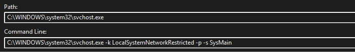

In the world of DFIR, the **Prefetch file (.pf)** is a long-time companion. It’s one of the first artifacts we analyze on a Windows workstation to confirm program execution, obtain a timestamp, determine run counts and so on... During many trainings, we’re taught a simple rule of thumb:

__*"An application needs to run for about 10 seconds to generate a valid Prefetch file."*__

I applied this rule without ever questioning it. I knew it worked, but I didn’t truly understand the reasoning behind it. **Why 10 seconds? Why not instantly? What is the operating system actually doing during that delay? And where did this technology originally come from?**

This article documents that little research. My goal is to bridge the gap between so that the next person who asks "why?" like me will finally get their answer.

# The Genesis: Solving the "Seek" Penalty

The Prefetch mechanism is a fundamental innovation within Microsoft Windows operating systems, first officially introduced with **Windows XP**. Its technical origin is rooted in the patent [US 6,633,968 B2, filed by Arthur Zwiegincew and James E. Walsh of Microsoft in 2003](https://patentimages.storage.googleapis.com/fe/e5/6d/f69b888fbc57a1/US6633968.pdf).

The initial challenge was simple yet crucial for perceived user performance: **how to reduce the latency time during the startup of applications and the operating system?** This slowness stemmed from hard page faults, where the system had to interrupt its work and wait for the necessary data blocks (pages) to be transferred, slowly, from the hard drive to RAM. The patented solution involves detecting and analyzing "**Scenarios**" of disk access (such as launching a program) to create Scenario files. 

These files contain the ordered list of pages that will be requested. Thanks to this prefetching mechanism, the system proactively loads these pages into RAM before they are requested, thereby converting long disk access delays into fast soft page faults, ensuring significantly better system responsiveness.

This flowchart illustrates the iterative process of managing and prefetching memory pages: when the system detects a Scenario, it checks for the existence of a pre-existing Scenario file to either analyze and create a new file (the bottom path) or open the existing file and load the corresponding pages into RAM (the right path) to prevent hard page faults:


<p style="text-align:center;">Flowchart of the Memory Page Prefetching Method upon Detection of a Page Fault Scenario (U.S. Patent 6,633,968 B2)</p>

# The Evolution of the prefetching mecanism in Windows

As I said, the Prefetching mechanism has evolved significantly since its introduction in **Windows XP**. The initial Prefetch feature focused on monitoring and logging hard page faults during system boot and application launch in order to create scenario files and improve startup performance.

This technology was renamed to **SuperFetch** with **Windows Vista**. SuperFetch did not replace the original Prefetcher service. Instead, it expanded it by adopting a more strategic and adaptive approach. Building on the existing mechanism, SuperFetch analyzes long-term usage patterns and proactively loads frequently used applications and data into RAM to improve responsiveness.

SuperFetch also works alongside **ReadyBoost**, a feature that allows one or more **USB flash drives** to be used as an additional caching layer. ReadyBoost takes advantage of the faster random-read performance of flash storage by storing encrypted cache files on the USB drive. This feature was especially helpful for laptop users who often had limited options for internal memory expansion.

In newer versions of **Windows 10 starting with version 1809 and in Windows 11**, the SuperFetch service was officially renamed **SysMain**. The core functionality remains essentially the same, focusing on dynamic prefetching and intelligent memory management. Microsoft has not provided an official explanation for the name change, so it is reasonable to assume that it was done to align the service with the modern Windows system architecture.


# The Internals – How a Prefetch is Born

If you read the section on the logical pre-reader in Windows Internals (4th, 6th, and 7th editions for service evolution), you will find a good description of how it works internally:

So when a new process begins running, the [Memory Manager](https://learn.microsoft.com/en-us/windows-hardware/drivers/kernel/windows-kernel-mode-memory-manager) first checks whether Prefetching is enabled. This policy is stored under ```HKLM\SYSTEM\CurrentControlSet\Control\Session Manager\Memory Management\PrefetchParameters\EnablePrefetcher```, and the value is loaded at boot to decide whether the system should track application launches, system boot, or both or nothing. The Prefetcher only becomes active once the process begins generating page faults, not at process creation.


During the first phase of execution, Windows starts a timed trace session instead of writing any file immediately. For applications, this trace window lasts roughly **10 seconds**, and for boot it ranges between **30 and 120 seconds** depending on system readiness. During this period, the kernel records hard faults, soft faults, NTFS metadata reads ($MFT), directory accesses, and the order in which pages are pulled from disk. All collected data is stored in nonpaged pool memory until the trace window completes. This avoids any early writes that might negatively affect startup performance.

Once the trace is ready, the kernel signals the event ```\KernelObjects\PrefetchTracesReady``` to notify user-mode code that it can retrieve the buffer. Depending on Windows version, this logic is handled either by the Task Scheduler service or by SysMain (the renamed SuperFetch service) via svchost: 



User Mode retrieves the trace using the internal system call ```NtQuerySystemInformation```  (**SystemPrefetcherTraceInfo**). Contrary to some misconceptions, this transfer does not use [ALPC](https://en.wikipedia.org/wiki/Local_Inter-Process_Communication), it is retrieved via a standard system-call interface.

At this point, the system must generate a unique Prefetch filename. Windows computes an **eight-digit hash from the executable’s full NT device path**. For certain hosting processes such as ```Svchost.exe, Rundll32.exe, Dllhost.exe, and Mmc.exe```, **the command line** is also included so that different hosted components create distinct trace files. The final naming pattern produces filenames like ```DLLHOST.EXE-1CEAE0B0```, ensuring that binaries sharing the same name but located in different directories never collide.

After the user-mode service retrieves the trace, it builds the Prefetch file by merging the new trace data with previous run history and assembling the metadata blocks that make up the .pf file (header, file metrics, volume information, and trace chains). Beginning with Windows 8, the Prefetcher compresses the file body using [XPRESS](https://learn.microsoft.com/en-us/openspecs/windows_protocols/ms-xca/a8b7cb0a-92a6-4187-a23b-5e14273b96f8), a variant of the **LZ77/Huffman algorithm**, which introduced the MAM signature in place of the older **SCCA** marker (that's why you see MAM/04 when you inspect the header of a compressed Prefetch and SCCA on a decompressed one). The system then writes the final file to ```%SystemRoot%\Prefetch```. The executed application itself only reads from the .pf file at startup, all write operations are performed exclusively by the system service.

A final internal detail is the rotational aging behavior. Older Prefetch formats were designed to store a maximum of **128 recorded executions**, and once this limit was reached, Windows replaced the oldest entry with new data. Since Windows 8, this limit has been expanded significantly and Prefetch files can now retain up to **1024 recorded** executions, which aligns better with modern storage capacity and faster disk performance.